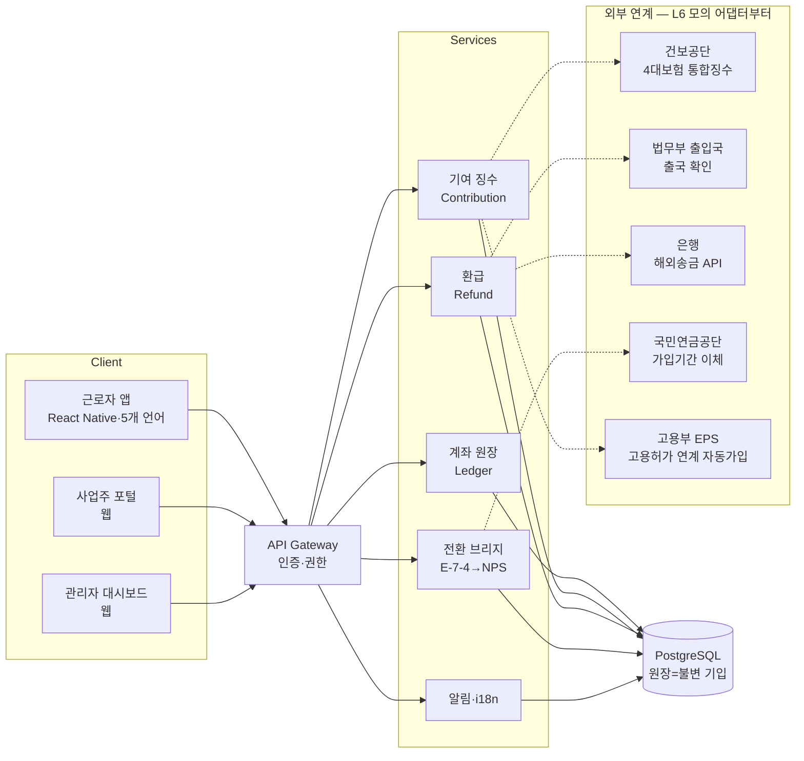

# 일하는 외국인 공제회 — 서비스 완성도 레벨 0→10 설계서
작성: 2026-10-04 · 대상: 코드데이원 개발팀 · 전제: 모든 제도 수치는 `index.html`의 PARAMS(검증치)만 사용

## 1. 레벨 정의 — 지금 어디고, 어디까지 가야 하나

| Lv | 이름 | 내용 | 산출물 | 상태 |
|---|---|---|---|---|
| 0 | 디자인 | 화면설계 13종·클로드디자인 목업·통장 컨셉 | docs/화면설계.md, 클로드디자인_브리프.md | ✅ |
| 1 | 정적 프로토 | 더블클릭 단일 html, 핵심 화면 동작 | index.html v0.2 | ✅ |
| **2** | **시나리오 데모** | 근로자 7화면+사업주+관리자, 상태 전환·시뮬레이터·신청 플로우 완주 | **index.html v0.3 ← 현재** | ✅ |
| 3 | 데이터 분리 | 하드코딩 → mock API(JSON)·상태관리 정리, 화면-데이터 계약 확정 | api-spec.md, fixtures/ | |
| 4 | 백엔드 MVP | 계좌 원장 DB·인증(외국인등록번호 모의)·REST API | server/ (Node+PostgreSQL 권장) | |
| 5 | 모바일 전환 | 근로자 앱을 React Native로 이식(5개 언어·푸시), 웹은 사업주·관리자용 유지 | mobile/ | |
| 6 | 연계 설계 | 통합징수·출입국·해외송금·NPS 브리지 — 인터페이스 명세+모의 어댑터 | integration-spec.md | |
| 7 | 보안·컴플라이언스 | 본인확인(e-KYC), 개인정보(외국인등록번호=고유식별정보), 전자금융 요건 검토 | 보안설계서 | |
| 8 | 파일럿 | 1개 사업장 폐쇄 베타(실데이터, 가상 지급) | 운영 리포트 | |
| 9 | 운영 준비 | 다국어 CS·관리자 운영도구·모니터링·몬테카를로 기금 대시보드(C2) | ops/ | |
| 10 | 실서비스 | 공제회법 제정·수탁기관(근로복지공단안) 확정 후 | — | 제도 성립 전제 |

※ L0~3은 코드데이원 단독 가능. L4부터 백엔드 인력, L6부터 기관 협의 필요. L10은 입법 사항이라 개발이 아닌 정책 트랙.

## 2. 목표 시스템 구조도 (L4~6 기준)



설계 원칙: **원장(Ledger)은 추가만 가능한 기입식** — 통장 UI 컨셉과 동일한 데이터 모델. 모든 금액은 월 기입 레코드의 합산으로만 산출(현 프로토의 account() 함수가 그 명세).

## 3. 핵심 데이터 모델 (L3에서 확정)

```
worker(id, name, country, visa, lang, wage, entry_date, nps_applicable, status)
employer(id, name, biz_no)
employment(worker_id, employer_id, start, end)
entry(id, worker_id, ym, type[worker|employer|return|refund|transfer], amount, rate)  ← 원장
refund_claim(id, worker_id, departure_date, bank, status[접수|출국확인|지급])
nominee(worker_id, name, relation, contact, kyc_status)
conversion(worker_id, new_visa, nps_transfer_amount, months_credited)
```
요율·이자율 등 제도 파라미터는 코드가 아닌 `params` 테이블(버전·시행일 포함) — 시행령 변경 대응.

## 4. 단계별 기술 스택 제안

| 영역 | 프로토(현재) | MVP(L4~5) | 비고 |
|---|---|---|---|
| 근로자 앱 | 바닐라 JS 단일 html | React Native(Expo) | 현 JS 로직·i18n 사전 그대로 이식 가능 |
| 사업주·관리자 | 〃 | React 웹 | 데스크톱 중심 |
| 서버 | 없음 | Node(NestJS)+PostgreSQL | 원장 불변성, 트랜잭션 |
| 인증 | mock | 외국인등록번호+본인확인(e-KYC 벤더) | L7 |
| 다국어 | STR 사전(ko/en/vi/ne/id) | i18next — 키 체계는 현 STR 유지 | 네팔어 데바나가리 폰트 필수 |
| 인프라 | 로컬 | 클라우드(정부망 요건은 L8에서 검토) | |

## 5. 금지·주의 사항 (팩트 규율 — 제안서·논문과 동일)
- 화면의 모든 제도 수치는 PARAMS만 사용. 임의 수치 추가 금지. 변경 시 `docs/` 근거 문서에 출처 기록
- "정부 매칭"·"세액공제"·"추가 적립" 등 **검토 단계 항목은 반드시 '(검토 중)·(시안)' 라벨**
- 관리자 통계 화면엔 "시연 데이터" 워터마크 유지 — 실통계 오인 방지
- 반환일시금 비교는 약식 산정임을 각주로 명시(현 vSim 참조)

## 6. 바로 다음 스프린트 (L3 제안)
1. index.html의 PARAMS·WORKERS·STR·COVERAGE를 `fixtures/*.json`으로 분리
2. API 명세 초안: GET /workers/:id/account, /ledger, POST /refund-claims, /nominees — 응답 스키마는 현 화면이 쓰는 필드 그대로
3. C2 재정 시뮬레이터: docs/ref_fund-simulator.jsx의 몬테카를로를 관리자 탭에 이식
4. 시연 시나리오(docs/기능정의.md "Ramesh") 자동화 스크립트 — 데모 영상용
